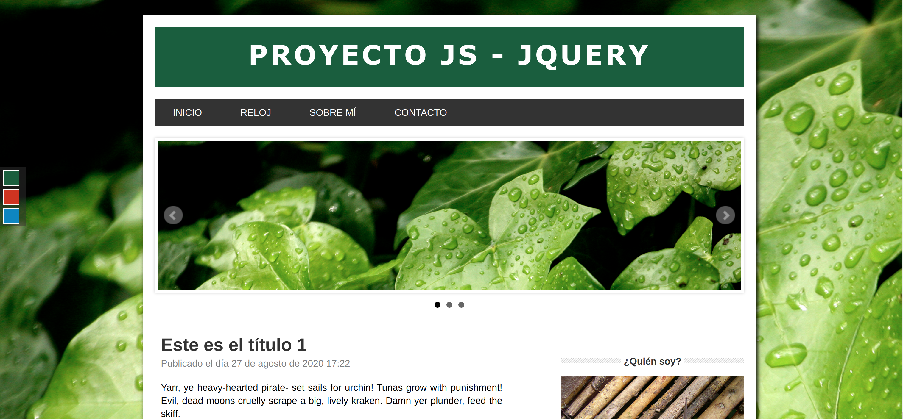

# Proyecto1-jQuery-JS-HTML-CSS

* Desarrollo completo de una web monolítica con HTML, CSS, JavaScript, jQuery y jQueryUI.
* Descargar fichero completo y abrir el archivo index.html para probar las funcionalidades.

Pasos seguidos:

1. Maquetación en HTML y CSS.

2. Incorporar plugin en jQuery para hacer un slider.
    * Incorporación bxslider
    
3. Crear un listado de post en formato JSON y mostrarlo dinámicamente.
    * Incorporación moment-with-locales.js para mostrar la fecha
    
4. Crear un cambiador de temas (cambio de colores y fondos de la web).

5. Al final de la web hacer un botón para subir al principio de la web haciendo una animación de scroll automático con jQuery.
   * Uso de método animate() con funcionalidad scrolltop

6. Hacer un formulario de login que nos permita guardar en el localStorage el nombre del usuario y en el caso de que exista "la sesión" mostrarla.

7. Selección "Sobre mí" en la que habrá un acordeón de jQuery UI.
    * Incorporación jQueryUI para usar accordion 
    
8. Sección "Reloj" en la que habrá un reloj dinámico con JavaScript.
    * Incorporación moment-with-locales.js para mostrar la hora
    
9. Sección de contacto con formulario y validación.
   * Incorporación jquery.form-validator.min.js para realizar validaciones
